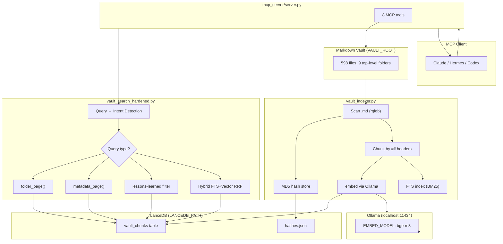
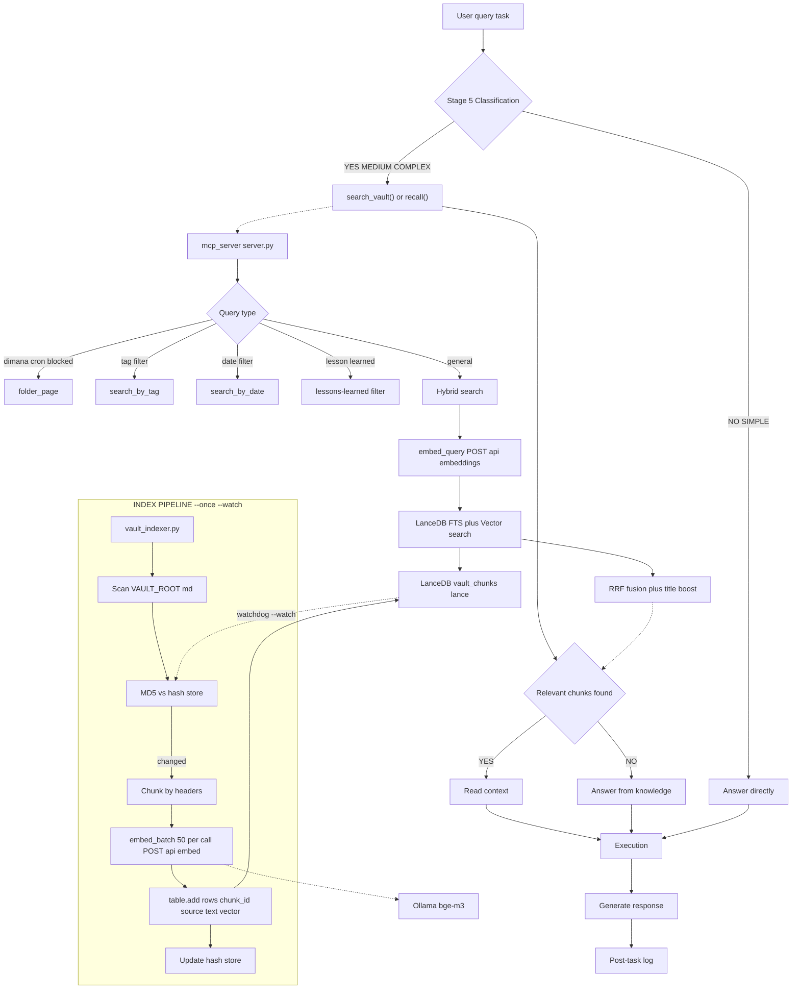

<p align="center">
  
  
  
  
  
</p>

<p align="center">
  
</p>

# Semantic Vault MCP

**Local RAG semantic search for Obsidian vaults — powered by Ollama + LanceDB + MCP.**

Search your markdown vault by **meaning** (not keyword matching). Runs fully local — zero API costs, zero data leaves your machine.

**Benchmark (2026-09-18):**
- Original 21-query golden set: **Hit@5 = 1.000** ✅
- Expanded 49-query set: **Hit@5 = 0.959** ✅ (target 95% met)
- Full reindex: **598 files → 4,886 chunks** (from 167 files → 899 chunks)
- Multi-file recall: **86 files / 3 pages** for broad queries

```
User query → Ollama embed → LanceDB hybrid search (BM25 + vector RRF) → relevant chunks → LLM context
```

## Features

- 🔍 **Semantic search** — find notes by concept, not keyword
- ⚡ **Batch embedding** — 30-50x faster than serial (50 chunks per HTTP call)
- 👁️ **Auto file watcher** — re-index files as they change (via watchdog)
- 🧩 **MCP server** — drop-in tool for Claude Desktop / Claude Code / Hermes
- 💾 **Persistent hash store** — incremental indexing, only re-index what changed
- 🔄 **Crash-safe** — circuit breaker for Ollama, batch writes to LanceDB
- 📁 **Folder routing** — auto-route location/status queries to relevant folders
- 🔗 **Multi-file recall** — progressive expansion (seeds → links → siblings) with pagination
- 🌐 **Bilingual** — handles Indonesian-English mixed vaults

## Quick Start

### Prerequisites

- Python 3.10+
- [Ollama](https://ollama.ai) running locally
- `bge-m3` embedding model pulled

```bash
# Install
pip install lancedb pyarrow watchdog requests

# Pull embedding model
ollama pull bge-m3

# Start MCP server
python mcp_server/entry.py
```

### MCP Client Config

Add to your MCP client config:

```yaml
semantic-vault:
  command: python
  args: ["mcp_server/entry.py"]
  env:
    VAULT_ROOT: /path/to/your/vault
    LANCEDB_PATH: /path/to/lancedb
    OLLAMA_BASE_URL: http://localhost:11434
    EMBED_MODEL: bge-m3
  working_directory: /path/to/semantic-vault-mcp
```

## Architecture



## Full Pipeline



## Commands

| Command | Description |
|---------|-------------|
| `python indexer/vault_indexer.py --once` | Index all vault files once (incremental) |
| `python indexer/vault_indexer.py --watch` | Run as file watcher daemon |
| `python indexer/vault_indexer.py --reindex` | Clear and re-index everything |
| `python mcp_server/entry.py` | Start MCP server (stdio transport) |
| `python eval/verify_release_wire.py mcp_server/server.py` | Full 50-query acceptance test |
| `python eval/recall_context_wire.py mcp_server/entry.py` | Multi-file recall wire test |
| `python eval/recall_coverage_tests.py` | Contract tests (9 tests) |

## Vault Maintenance

### Weekly (Sunday)

Generate folder index + health report:

```bash
# Update folder index.md files (auto-generate)
python scripts/vault_generate_index.py

# Run comprehensive vault health check (9 checks)
python scripts/vault_health_weekly.py
```

**`vault_generate_index.py`** — Generate/update `index.md` files for all vault folders. Lists files with title, description, status. Skips folders with manual `index.md`.

**`vault_health_weekly.py`** — Comprehensive health check:
1. Orphan files (no inbound links)
2. Broken wikilinks (unresolvable)
3. Duplicate content (exact MD5)
4. Merge candidates (similar names/content)
5. Tag quality (missing, inconsistent)
6. Index coverage (vault doctor)
7. Stale files (not modified in 90 days)
8. File size distribution
9. Folder balance

Output: detailed report in `04-LOGS/weekly-note/YYYY-MM-DD-vault-health.md`.

### Monthly (1st of month)

Query log analysis:

```bash
python3 -c "
from pathlib import Path
log = Path.home() / '.hermes/vault_vectors/query_log.jsonl'
if log.exists():
    lines = log.read_text().strip().splitlines()
    print(f'Total queries: {len(lines)}')
"
```

Counts total queries logged in `~/.hermes/vault_vectors/query_log.jsonl`. Use to analyze usage patterns and identify popular search terms.

## MCP Tools

| Tool | Description | When to use |
|------|-------------|-------------|
| `search_vault(query, top_k=15)` | Semantic search by meaning | Find content by concept |
| `search_by_tag(tags, limit=20)` | Metadata filter by tags | Filter by specific tags |
| `search_by_date(date, limit=20)` | Metadata filter by date | Find entries from specific dates |
| `recall(topic, char_budget=7000, top_k=20)` | Multi-file context expansion | Broad topic needing many related files |
| `read_vault_file(filepath)` | Read full file content | Need full context after search |
| `vault_stats()` | Index statistics | Check index health |
| `get_chunk(source)` | Get all chunks for one file | Debug indexing |
| `reindex_file(filepath)` | Re-index single file | After editing outside watcher |

### Multi-File Recall

```
recall("crypto bot ggscalping wallet tracking", char_budget=7000)

1. Seeds = search_vault results (ranked)
2. Expansion rounds:
   - Round 1: Exact one-hop [[wikilinks]] from seeds
   - Round 2: Cluster siblings (≥2 seeds in same project folder)
3. Hard budgets:
   - MAX_FILES = 40
   - MIN_EXCERPT = 250 chars
   - MAX_FILE_TOPUP = 1500 chars
4. Provenance: seed/sibling/neighbor labels
5. Pagination: snapshot-checked, offset-based
   - omitted_sources / partial_sources / unresolved_links reported
```

## Benchmark Results

| Metric | Original (21q) | Expanded (49q) |
|--------|----------------|----------------|
| Hit@1 | 0.905 | 0.735 |
| Hit@3 | 0.952 | **0.898** ✅ |
| Hit@5 | **1.000** | **0.959** ✅ |
| MRR | 0.940 | 0.828 |

**Root cause fix:** 73% of vault files were not indexed (167→598 files, 899→4,886 chunks).

**Fixes applied:**
- Title boost (filename matching for query relevance)
- Folder routing (location/status queries)
- Post-fusion filter (lesson-learned queries)
- Bilingual aliases (Indonesian-English matching)
- Tag-specificity sorting (fewer tags = more specific)

## Environment Variables

| Variable | Required | Default | Description |
|----------|----------|---------|-------------|
| `VAULT_ROOT` | ✅ | `./vault` | Path to markdown vault |
| `LANCEDB_PATH` | ✅ | `./data/lancedb` | Vector store path |
| `OLLAMA_BASE_URL` | ✅ | `http://localhost:11434` | Ollama endpoint |
| `EMBED_MODEL` | ✅ | `bge-m3` | Embedding model |
| `CHUNK_SIZE` | ❌ | `512` | Child chunk size (chars) |
| `PARENT_SIZE` | ❌ | `800` | Parent chunk size (chars) |
| `CHILD_SIZE` | ❌ | `250` | Child chunk size (chars) |
| `OVERLAP` | ❌ | `64` | Chunk overlap (chars) |
| `BATCH_SIZE` | ❌ | `50` | Embedding batch size |
| `EXCLUDE_DIRS` | ❌ | `.obsidian,.trash,.git,__pycache__` | Folders to skip |
| `MAX_BACKUPS` | ❌ | `2` | Backup retention count |
| `WATCH_INTERVAL` | ❌ | `5` | File watcher interval (seconds) |

## Project Structure

```
roowet-semantic-vault-search/
├── README.md                  # This file — quick start + reference
├── AGENTS.md                  # Hermes integration guide
├── SOUL.md                    # Agent identity template
├── LICENSE                    # MIT
├── pyproject.toml             # pip install .
├── requirements.txt           # Python deps
├── .env.example               # All env vars documented
├── .gitignore
├── setup.bat                  # Windows one-click setup
├── setup.sh                   # Linux/Mac one-click setup
├── indexer/
│   ├── __init__.py
│   └── vault_indexer.py       # Scan → chunk → embed → store
├── mcp_server/
│   ├── __init__.py
│   ├── server.py              # MCP protocol + search logic
│   └── entry.py               # Entry point
├── vault_search_hardened.py   # Hardened search (folder routing, lesson filter)
├── vault_search_candidate.py  # Hybrid RRF fusion + title boost
├── vault_release_handlers.py  # MCP handlers (recall, metadata tools)
├── vault_recall_context.py    # Multi-file recall with pagination
├── scripts/
│   ├── session_scan.py        # Batched session → vault ingestion
│   ├── vault_generate_index.py # Auto-generate index.md for folders
│   └── vault_health_weekly.py # Comprehensive vault health check
├── eval/
│   ├── verify_release_wire.py # Full 50-query acceptance test
│   ├── recall_context_wire.py # Multi-file recall wire test
│   ├── recall_coverage_tests.py # Contract tests (9 tests)
│   ├── golden_queries.json    # 50-query golden set
│   └── *.py                   # Other eval scripts
├── skills/
│   └── scanthissession/       # Session scanner skill
│       └── SKILL.md
├── vault-structure/           # Example vault layout
│   ├── README.md
│   ├── obsidian-setup.md
│   ├── 06-SYSTEM/rules/       # Naming, routing, MOC rules
│   ├── 06-SYSTEM/templates/   # 28 note templates
│   └── 00-NOTES/ … 08-DOCS/   # Empty folder examples
└── docs/
    ├── ARCHITECTURE.md        # Data flow + design decisions
    └── banner.jpeg
```

## Requirements

- **Ollama** with any embedding model (tested: `bge-m3`, `nomic-embed-text`)
- Python packages: `lancedb`, `pyarrow`, `requests`, `watchdog`
- ~2GB RAM for LanceDB (depends on vault size)

## Path Setup

Files in this repo use **relative paths** — no hardcoded PC paths. Configure via `.env`:

```env
VAULT_ROOT=/path/to/your/vault
LANCEDB_PATH=/path/to/lancedb
OLLAMA_BASE_URL=http://localhost:11434
EMBED_MODEL=bge-m3
```

For Windows:
```env
VAULT_ROOT=C:/Users/you/your-obsidian-vault
LANCEDB_PATH=C:/Users/you/AppData/Local/hermes/scripts/vault_vectors
```

**Why regular indexing matters:**

The RAG search is only as good as your index. If you add/edit 50 files but haven't re-indexed, the search will return **stale chunks** — or miss new content entirely.

The indexer uses MD5 content hashes to detect changes, so re-indexing is fast:

```bash
# Incremental — only processes changed files (usually <1 second)
python indexer/vault_indexer.py --once
```

**Recommended cadence:**
- **Manual:** Run `--once` after any significant vault edit session
- **Cron:** Auto-index every 30 minutes via systemd timer
- **Watch mode:** `--watch` for real-time indexing (runs as daemon)

When in doubt: **re-index before every AI agent session.** A 1-second re-index can save you from getting answers based on stale vault content.

### Systemd Timer (Linux)

```ini
# ~/.config/systemd/user/vault-indexer.timer
[Unit]
Description=Vault Indexer Timer

[Timer]
OnCalendar=*:0/30
Persistent=true

[Install]
WantedBy=timers.target
```

```bash
systemctl --user enable --now vault-indexer.timer
```

## FAQ

**Q: How long does initial indexing take?**
A: ~3-5 minutes for 598 files with bge-m3. Batch embedding does 50 chunks per call. Incremental re-index takes <1 second.

**Q: Can I use other embedding models?**
A: Yes. Set `EMBED_MODEL` in `.env`. Tested with `bge-m3` (1024d) and `nomic-embed-text` (768d). Multilingual models work best for mixed-language vaults.

**Q: Does it support incremental updates?**
A: Yes. Indexer tracks file content hashes (MD5). Re-run `--once` to only index changed files.

**Q: Can I use this without Obsidian?**
A: Yes. Any folder with `.md` files works. Set `VAULT_ROOT` to any markdown directory.

**Q: What's the difference between `search_vault()` and `recall()`?**
A: `search_vault()` returns top-K unique files (ranked). `recall()` expands to multiple files via wikilinks and sibling folders — use when you need comprehensive topic coverage.

**Q: Why are some queries returning None?**
A: Check: (1) Is Ollama running? (2) Is the index up-to-date? (3) Is `VAULT_ROOT` set correctly? (4) Does the expected file exist in the vault?

## Skills

### `/scanthissession` — Session Scanner & Vault Writer

The agent scans the session transcript, detects vault-relevant items (errors, decisions, corrections, lessons, etc.), then **automatically writes them to the correct vault folder**.

```bash
/scanthissession
# or say: "scan session", "log this session"
```

**When:** after a long session (>10 tool calls), before ending a session.
**Output:** files written to `<VAULT_ROOT>/01-AGENT-MEMORY/...` + daily-note updated.

## License

MIT
